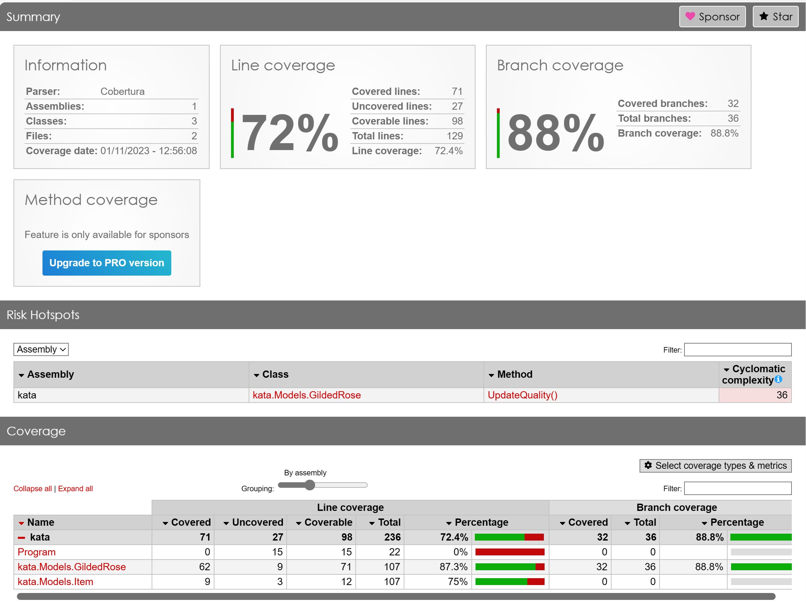
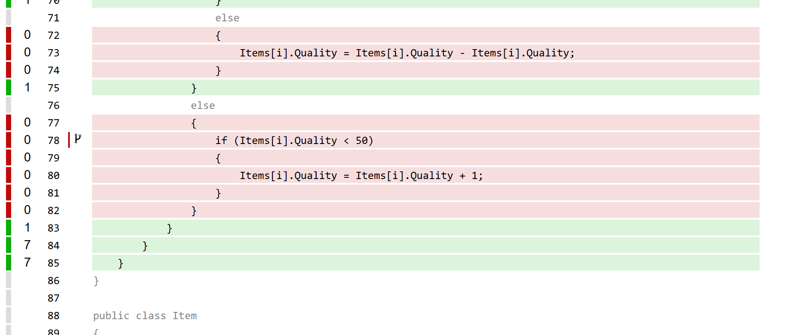

# Kata project

The idea with this Kata is to take some enterprise code and improve it. To do so in a safe manner, we will first add tests and achieve a test coverage we're happy with, then refactor the code to make it more readable and maintainable.

## Step 1 - add tests

1. type the following prompt in Copilot Chat with *Models.cs* as open file:

    ```text
    suggest test code for 5 different tests of update quality
    ```

    this will suggest a number of tests for the `UpdateQuality` method.

1. Add suggested tests to kata.test project, change the code as needed to ensure it compiles and run the tests.

## Step 2 - check coverage and add more tests if needed

First, we need to add the coverage tools and reporting tools so that we can understand our test coverage percentage:

### References

- <https://docs.microsoft.com/en-us/dotnet/core/testing/unit-testing-code-coverage?tabs=windows>

### Collect code coverage data

Run below to collect code coverage:

```bash
dotnet test --collect:"XPlat Code Coverage"
```

This command will generate a file called `coverage.cobertura.xml` in the *TestResults* folder in your test project.

### Add reporting tool:

Run below to install the reporting tool:

```bash
dotnet tool install -g dotnet-reportgenerator-globaltool
```

### To create the reports:

```bash
reportgenerator
-reports:"Path\To\TestProject\TestResults\{guid}\coverage.cobertura.xml"
-targetdir:"coveragereport"
-reporttypes:Html
```

If you're in the same folder as the *coverage.cobertura.xml* file, you can run:

```bash
reportgenerator -reports:"coverage.cobertura.xml" -targetdir:"coveragereport" -reporttypes:Html
```

Now you should have a folder called *coveragereport* with an *index.html* file. Open it in your browser to see the report.



Here's a detail coverage of the coverage for the `UpdateQuality` method:



As you can see, there's more to do. Let's ask Copilot Chat.

### Add more tests

1. Let's add more tests using Copilot. Add the following prompt in Copilot Chat with the test file as active file:

    ```text
    can you suggest additional tests and code to increase test coverage?
    ```

1. Rerun coverage tool and check the report.

    Note that you know have a new subdirectory in *TestResults* folder, ensure you generate the report from that folder.

With a little luck, you should now have 100% test coverage on the *UpdateQuality* method which means we can move to our third step which is to refactor the code.

### Solution 

Check out the "01-add-tests" branch


## Step 3 - refactor

Select the *Models.cs* file and type the following prompt in Copilot Chat:

```text
improve this code, ensure every type of item have a dedicate class and an UpdateQuality method
```

Becase you're doing big changes now, you need to fix your *Program.cs* file and your test file as they both will have compilation errors.

For each of those two mentioned files, open them and type the following prompt in Copilot Chat:

```text
change this code so it compiles, leverage the new item types
```

Now your code should compile, run the tests and check the coverage report. It should still be 100% on your *UpdateQuality* method.

### Solution

Check out the "02-refactor" branch

That's it, you're done! Congrats, now you see how Copilot can help you refactor safely, by adding tests and ensuring you don't break anything and then by suggesting code to improve your codebase.